# Group Project: Design Journey

**For each milestone, complete only the sections that are labeled with that milestone.** Refine all sections before the final submission.

You are graded on your design process. If you later need to update your plan, **do not delete the original plan, leave it in place and append your new plan _below_ the original.** Then explain why you are changing your plan. Any time you update your plan, you're documenting your design process!

**Replace ALL _TODOs_ with your work.** (There should be no TODOs in the final submission.)

Be clear and concise in your writing. Bullets points are encouraged.

**Everything, including images, must be visible in _Markdown: Open Preview_.** If it's not visible in the Markdown preview, then we can't grade it. We also can't give you partial credit either. **Please make sure your design journey should is easy to read for the grader;** in Markdown preview the question _and_ answer should have a blank line between them.

## Client (Milestone 1)

### Client Description (Milestone 1)
> Tell us about your client. Who is your client?
> Explain why your client meets the client rules in the project requirements.

The Cornell Grilling Club is our client, and we are communicating with its president, John Hanna. It is a newly university-affiliated club that is looking to commence grilling operations on campus. The client needs a website, and that wesbite would help it both in its operations and in gaining more traction on campus.

### Client Questionnaire (Milestone 1)
> Develop a client questionnaire to learn more about your client and their goals.
> You may use the questionnaire below, you may modify the questionnaire below, or you may create your own.

1. Describe your organization and its purpose.
We are a grilling oriented student organization that seeks to increase student knowledge of grilling and create a fun social atmosphere.

2. What makes your organization and its services special or unique?
We are the only grilling club on Cornell's campus, and we hope to create a fun and inclusive environment to bring the community together.

3. Why are you looking for a new website or updating your existing site?
We are looking to create a new website to reach out to potential new members and grow our image and reputation on campus.

4. Who do you want to visit your site? Who do you believe is your website's intended audience?
Other members of the Cornell community who want to learn more about Cornell Grilling club, and who have any interest in grilling.

5. When visiting your site, what actions do you want your visitors to take?
I would like potential visitors to see who the club members are and how they can join, as well as learning about what exactly the club's operations consist of.

6. What are your goals for this site?
To gain more members and for more people in the Cornell community to learn about the club's presence.

7. Is there a "feel" that you want for your site? Are there colors or imagery that you have in mind?
I would like the website to have a "bright" theme with lots of meats and people. A red color scheme would fit this theme.

8. What are your three favorite competitors or similar organizations' websites? Why?
We have no competitors.

### First Client Meeting Minutes/Notes (Milestone 1)
> Include your notes/minutes from your first meeting with your client.

The client is very excited for the club to have a website, and mainly hopes it will grow the club's on campus presence.

### Client Website (Milestone 1)
> Tell us about the website that your client wants.
> Tell us the purpose of the website and what it is all about.
> Note: **If you are redesigning an existing website, give us the current URL and some screenshots of the current site.** (FireFox makes it easy to take a full screenshot of a page from the context menu (right click).)
> If you are redesigning an existing site, tell us how you plan to update the site in a significant way that meets the project's requirements.

The website is made to inform people in the Cornell community about the club's operations, and should encourage people to join the club and come to events. The club should show people how to join, when and how to come to events, and show who is part of the club and what they do.

### Client Goals (Milestone 1)
> Identify your client's goals for the website.
> What kind of website do they want? What are their goals for the site?
> There is no required number of goals. You need as many goals as necessary to reflect your client's desires.

- Show people how to join the club (link to campus groups and groupme)
- have a people page
- have an about page
- have many images of meats the club plans to grill, and the equipment used
- describe club's operations
- FAQ page

  The client would like a simple website with only a handful of pages. Those pages should include a home page, a team page with the club members, an about page that describes what operations consist of, and a page dedicated to joining the club

### Client Website Scope (Milestone 1)
> We want your project to be successful! It needs to be ambitious, but not too large.
> A good rule-of-thumb is that you should have about 1 content-full page for each team member.
> Explain why the website you will create for your client isn't too small and isn't too big.
> Explain why you think it's the right size for this project.

The propsed website is the right "size" for this project because it intends to have about as many pages as there are members in our team. Additionally, each page is planned to have about the same amount of content. The website is not too small for the client as it will encompass every goal the client wants met. Subsequently, each page should reflect a different different goal of the client, and the website as a whole will encompass the overarching goals the client has of growing its presence and being as informative as possible.

## Plan/Schedule (Milestone 1)
> Make a plan of when you will complete all parts of this assignment.
> This plan is for your team. There is no required format. Format it so that it works for you!
> Your plan should include when you will interview users and analyze their goals.
> Your plan should also include how and when you will assemble/create the sit's content.
> **Tip:** Your team should plan to work ahead. This project really isn't feasible to complete the night before a deadline.

Our team plans to have our interviews done by Friday the 14th. That way, we can get started with gathering content that will cater towardss the client and audience. We want to finish card sorting/have a layout by the 20th so we present it to the client and get started on coding the website so we can have a draft by the milestone 2 deadline.

## Understanding Users (Milestone 2)

**Make the case for your decisions using concepts from class, as well as other design principles, theories, examples, and cases from outside of class.**

You can use bullet points and lists, or full paragraphs, or a combo, whichever is appropriate. The writing should be solid draft quality, but it doesn't have to be fancy.

### User Interview Questions (Milestone 2)
> Plan the user interview which you'll use to identify the goals of your site's audience.
> You may use the interview template below and revise it as much as you desire.

**User Interview Briefing & Consent:** "Hi, I am a student at Cornell University. I'm currently taking a class on web design and for a project, I am designing the website for Cornell Grill Club. I'm trying to learn more about the people that might use this site. May I ask you a few questions? It will take about 10 minutes. You are free to quit at any time."

1. Please tell me a bit about yourself. You may omit any personal or private information.

2. What devices do you typically use when visiting school club websites? Why?

3. Is there any way school club websites aren’t supporting your needs currently?

4. Is there anything you or your peers often look for on school club website that is missing or hard to find?

5. (i) How do you normally get to school club website?
  (ii) What terms do you typical search for?

6. What haven't I asked you today that you think would be valuable for me to know?

**After the interview:** "This was really helpful. Thank you so much for agreeing to speak with me today. Have a great day!"

### Interview Notes (Milestone 2)
> Interview at least 1 person for every member of your team from your audience.
> Take notes and include those notes here. Make sure to include a brief description of each interviewee.
> **Copy the interview questions above into each interviewee section below.**
> Take notes for each participant inline with the questions.

**Interviewee 1:**

The first participant was an engineering student that was potentially interested in joining a new club.

1. Please tell me a bit about yourself. You may omit any personal or private information.
Hi, I’m currently an undergrad Junior studying computer science in the College of Engineering.

2. What devices do you typically use when visiting school club websites? Why?
I usually use my laptop when I visit school club websites. Because I normally look for clubs to join in the beginning of the semester, I just open multiple tabs on my computer to view different clubs which is easier to see than mobile device.

3. Is there any way school club websites aren’t supporting your needs currently?
School websites usually don’t have FAQ page which would be really helpful when learning about an organization of Cornell.

4. Is there anything you or your peers often look for on school club website that is missing or hard to find?
I often look for recent or upcoming events that the club have, but it was usually missing or hard to find on their websites.

5. (i) How do you normally get to school club website?
I normally get to school clubs websites by web searching.
(ii) What terms do you typical search for?
I search for terms such as “Cornell Club”, or “Cornell _keyword_ Club”. For example, if I was looking for a club with keyword ‘baking’, I would search up “Cornell Baking” or “Cornell Baking Club”.

6. What haven't I asked you today that you think would be valuable for me to know?
No, thank you!

**Interviewee 2:**

The second participant is a sophomore engineering student at Cornell.

1. Please tell me a bit about yourself. You may omit any personal or private information.
My name is Melenie and I'm a sophomore studying ORE in the College of Engineering. My family is from Mexico, and I grew up in Texas.

2. What devices do you typically use when visiting school club websites? Why?
I probably use my computer most often because I am usually doing work on there, so it's easier for me to just open a new tab than to take out my phone. Rarely, though, I might not be using my computer and I'll just look it up on my phone.

3. Is there any way school club websites aren’t supporting your needs currently?
Usually school club websites might list the club email, but they almost never have the personal contact information of their members. I feel like if people have questions about the club, they would rather have a more personal connection and directly reach out to a member of choice.

4. Is there anything you or your peers often look for on school club website that is missing or hard to find?
Sometimes I wish some clubs had a page where you could sign up for a newsletter or a campus groups or a groupme, but instead they just have an about us page with some contact information.

5. (i) How do you normally get to school club website?
I usually just do a simple google search of the club name and click on the first link.
(ii) What terms do you typical search for?
I usually just search up the name of the club if I know it, or if I'm not sure if a club exists I'll just look up the name of the activity followed by "Cornell".

6. What haven't I asked you today that you think would be valuable for me to know?
Should I join Grilling club?

**Interviewee 3:**

My participant is a sophomore at Cornell studying info sci. Her hobbies include watching kdramas and anime.

1. Please tell me a bit about yourself. You may omit any personal or private information.
She is a sophomore at Cornell studying info sci. Her hobbies include watching kdramas and anime.
1. What devices do you typically use when visiting school club websites? Why?
I usually use my laptop and my phone. I use my laptop when I want to see a lot of info at once and phone when I quickly need to see dates or the location of a club event.
1. Is there any way school club websites aren’t supporting your needs currently?
Some school club websites are too confusing. There is too much info on the homepage and it's disorganized. A lot of websites don't have enough photos and I want to see whats actually happening instead of text.
1. Is there anything you or your peers often look for on school club website that is missing or hard to find?
A lot of websites don't include the events or reoccuring events you can sign up for. A lot of websites aren't updated and are for years ago and I can't tell if the program is still happening or not.
1. (i) How do you normally get to school club website? Usually if I see a poster up then I'll search up the name or the qr code on it. Or I check campus groups on my laptop.
  (ii) What terms do you typical search for?
  Terms I would use are the name of the club and cornell.
1. What haven't I asked you today that you think would be valuable for me to know?
None.

**Interviewee 4:**

This is a current undergrad student who is currently looking for clubs to be involved in for next year. They have expressed interst in clubs that are centered around food.

1. Please tell me a bit about yourself. You may omit any personal or private information.
Hi I’m currently an undergrad sophomore studying Applied Economics and Management in the Dyson school. I'm really passionate about cooking so I'm looking for ways to be able to do that on campus with other students who might have a similar interest like I do.

2. What devices do you typically use when visiting school club websites? Why?
I usually check out the school websites when by using my cell phone. This is mainly because pulling out my phone during clubfest is pretty easy and I can just scan the qr code and see the website.

3. Is there any way school club websites aren’t supporting your needs currently?
I feel like a lot of them are pretty empty and do not really have anything that shows that things are acutally happening. It more than often seems like the website is unattended and like the club might not be running anymore.

4. Is there anything you or your peers often look for on school club website that is missing or hard to find?
One of the things that I often like to do is look for ways for me to able to connect with current members. However, commonly, the only thing listed is the general contact information, nothing specific. Oh, and also a photo gallery. I like to see what activities might look like here and it is pretty common to not see these things in sites.

5. (i) How do you normally get to school club website?
I'll usually either just search up the name if I see it around campus or I'll go through campusgroups.
(ii) What terms do you typical search for?
I will usually search for terms like "food club Cornell" or "cooking at Cornell" to see what some options there are.

6. What haven't I asked you today that you think would be valuable for me to know?
No I don't think so

**Interviewee 5:**

1. Please tell me a bit about yourself. You may omit any personal or private information.
   My name is Jayson and I am a junior in Engineering Physics.

2. What devices do you typically use when visiting school club websites? Why?
   I normally use my laptop because sometimes they are anniying to navigate on my mobile device.

3. Is there any way school club websites aren’t supporting your needs currently?
   Most club website arent updated. Just recently I wasnt able to attend a club fair and so i looked at the club registry instead. Most cornell club websites didnt have recent information or information at all

4. Is there anything you or your peers often look for on school club website that is missing or hard to find?
  What we often look for is a detailed description of a club, and when/where they meet.

5. (i) How do you normally go to school club website?
 I rarely go to school club websites
   (ii) What terms do you typical search for?
 I search for terms such as event details, club members, and past events
6. What haven't I asked you today that you think would be valuable for me to know?
   A more visually appealing website helps retain attention and increases interest in the club.

### Goals (Milestone 2)
> Analyze your audience's goals from your notes above.
> List each goal below. There is no specific number of goals required for this, but you need enough to do the job (Hint: It's more than 1 and probably more than 2).

Goal 1: Convey event information

- **Design Ideas and Choices** _How will you meet those goals in your design?_
  - The events will be clearly labeled and spaced out with the use of contrasting colors and bright colors.

- **Rationale & Additional Notes** _Justify your decisions; additional notes._
- We are thinking about including images that are connected to the activity to show what these events might look like. We will do this by creating a theme that. People are coming to the website to see when events might be happening and see if they can see things space out and with enough contrast they can feel more at ease using the site. We will use cool colors to get feelings of tranquility as well as make sure that the events are easy to read. Schedule constraints can cause stress and this will help reduce that.

Goal 2: Show club members

- **Design Ideas and Choices** _How will you meet those goals in your design?_
  - This can be achieved by putting images of the members with a brief name and bio.

- **Rationale & Additional Notes** _Justify your decisions; additional notes._
  - Make sure that every name is legible and that the colors used can work with the theme of the page. (if bio were to be include it would be smaller than the name and big enough to read) The photo would go at the top and the bio would be below it, following a familiar layout that many websites have. By using a common design template, users will know how to navigate the site and not have to worry about learning a new site which means they won't get frustated in using our site.

Goal 3: Convey club mission

- **Design Ideas and Choices** _How will you meet those goals in your design?_
  - Big and Bold: Making a bold statement with the club mission at the top using colors that are associated with grilling, red and black.

- **Rationale & Additional Notes** _Justify your decisions; additional notes._
  - The audience is coming here to learn more about what the club is, its values. Yes the club can exist but if there is nothing that shows what makes the club different then there really is no difference. This design will incorporate the use of warm colors that align with grilling and cooking that show that a knitted community is a vital thing for the club.

### Audience (Milestone 2)
> Briefly explain your site's audience.
> Be specific and justify why this audience is a **cohesive** group with regard to your website.

The audience consists of all Cornell students, faculty, and staff interested in grilling.

## Website Design Exploration (Milestone 2)

Identify three websites (preferably static websites) that exist today on the web to draw inspiration from. Please select websites that are similar to the website you wish to create.

Include two screenshots of the home page for each site: narrow and wide.

**We'll refer to these are your "example websites."**

1. <http://www.cornellconsultinggroup.org>

    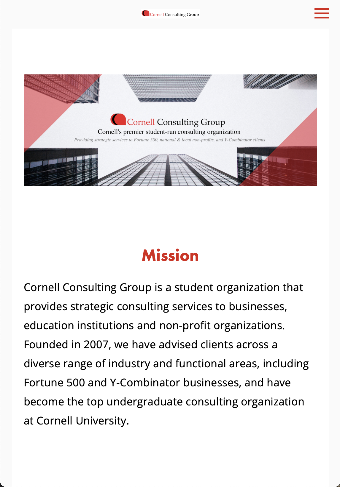

    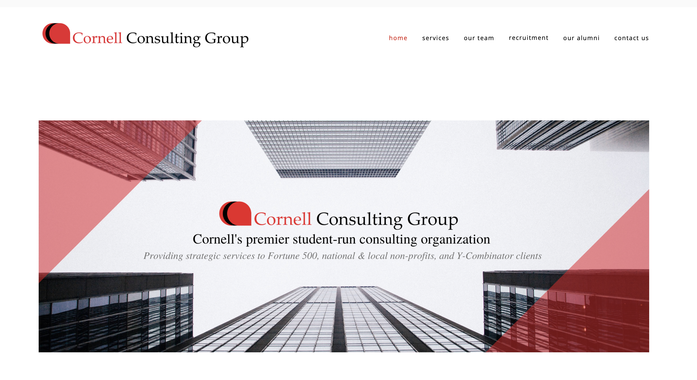

2. <https://www.cremedecornell.net/home-1>

    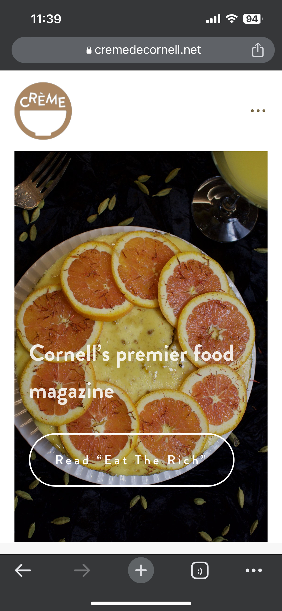

    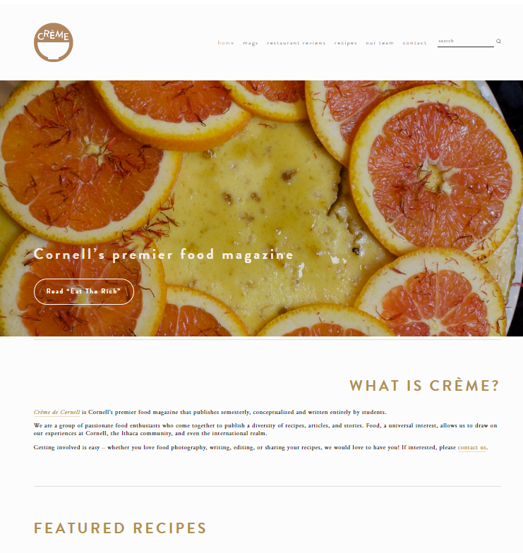

3. <https://www.beeclubatcornell.org/>

    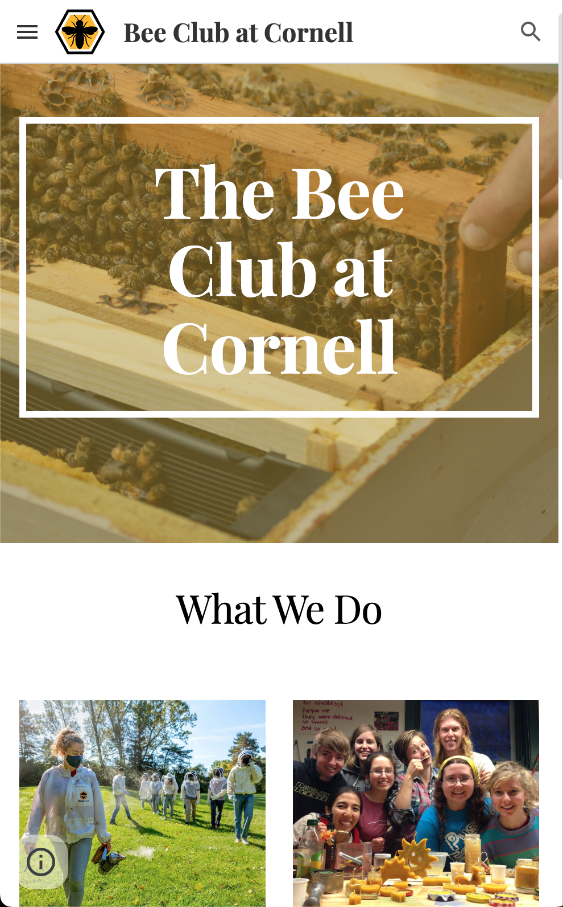

    

### Example Website 1 Review (Milestone 2)
> Review the website you identified above. (1 paragraph)
> In your review, include a discussion common design patterns and interactivity in the site.

One of the common things that we can see is that when the website becomes minimized is that the navigation menu disappears and it becomes a hamburger menu. Another good thing is that when minimized the importannt information, the "important" information remains at the front. There is no delay in transitioning from the wide and narrow sites and works flawlesly. There is a lot css working which gives the user feedback as to what they are doing, such as hovering on an element.

### Example Website 2 Review (Milestone 2)
> Review the website you identified above. (1 paragraph)
> In your review, include a discussion common design patterns and interactivity in the site.

The Creme de Cornell Website has a simple layout and design. The website's structure and layout mirrors those of most organizations' websites with a navigation bar at the top next to the logo, several internal links on the home page along with descriptions of the club. Since we are making a website for a food-related club, I though this would be a relevant sample website to draw inspiration from.

### Example Website 3 Review (Milestone 2)
> Review the website you identified above. (1 paragraph)
> In your review, include a discussion common design patterns and interactivity in the site.

The website I chose to draw inspiration from is Bee Club at Cornell. It is another club at Cornell and I really like the format of it. On the homepage, we see attractice images along with "What We Do", "Mission", "Meeting Times", and "Sign up". The page is simple and attractive and keeps a theme of black and yellow like bees.

## Content Planning (Milestone 2)

Plan your site's content.

### Your Site's Planned Content (Milestone 2)
> List **all** the content you plan to include your website.
> You should list all types of content you planned to include (i.e. text, photos, images, etc.)

- text
- images
- links to CampusGroups, club slack, listserv
- logo

### Content Justification (Milestone 2)
> Explain (about a paragraph) why this content is the right content for your site's audience and how the content addresses their goals.

These content decisions make sense for our website because they are all common things that one would expect from a club. Having a logo gives us a brand and links are essential so that students can actually sign up for events that we hold and be informed about them through the listserv/slack. As for text, that's essential because it will ake up the majority of the content of our website and images will add texture to the website so it isn't a boring, dull website.

## Information Architecture (Milestone 2)

### Content Organization (Milestone 2)
> Document your **iterations** of card sorting here. You must have at least 2 iterations of card sorting.
> Include photographic evidence of each iteration of card sorting **and** description of your thought process for each iteration.
> Please physically sort cards; please don't try and do this digitally.

Iteration 1: I sorted all aspects of the Cornell Grilling club by categories for the Homepage, Teampage, About page and Joining Page

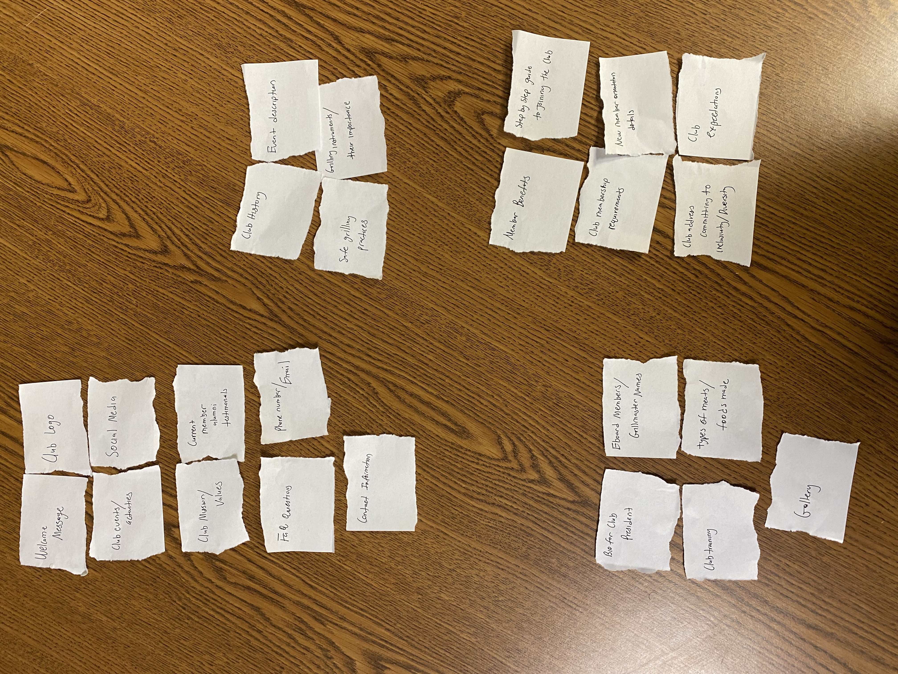

Iteration 2: In the previous iteration I sorted the FAQ , contact information, phone number and email along with elements you would expect to see in the homepage such as welcome message, and club mission/values. Dedicating a page the FAQ/contact information ,expressed in this iteration, allows visitors to find the information they need more quickly and efficiently. This makes the website more organized and easier to navigate for the user.

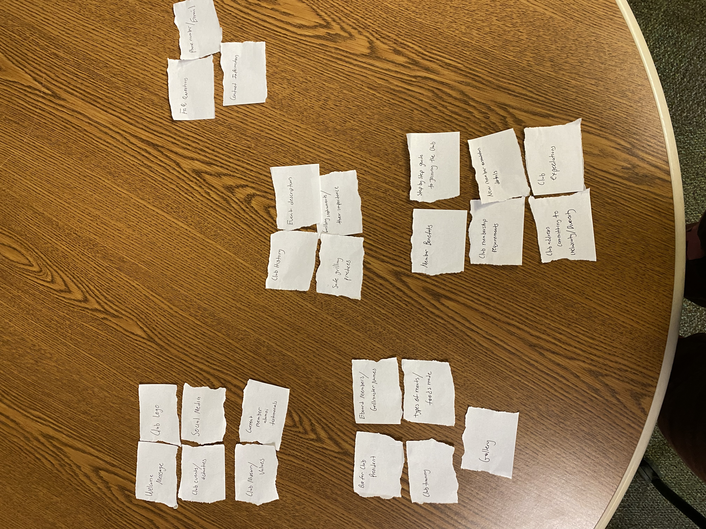

### Final Content Organization (Milestone 2)
> Which iteration of card sorting will you use for your website?

We will be using Iteration 2
> Explain how the final organization of content is appropriate for your site's audiences.

This content organization makes sense for the Cornell grilling club's audience because it provides clear and concise information about the club's purpose, leadership, membership requirements, benefits, etc. The organization helps potential members quickly and easily navigate the site to find the information they need to make an informed decision about joining the club. Additionally, the comprehensive FAQ page provides answers to common questions that can help address any concerns or confusion potential members may have.

### Navigation (Milestone 2)
> Please list the pages you will include in your website's navigation.

- Home
- About
- Members
- Joining
- FAQ

**We changed the name of the Team page to Members because it makes more sense.

> Explain why the names of these pages make sense for your site's audience.

The names of these pages make sense for our site's audience because this is a website for a club at Cornell. The home page will have links to all the pages and crucial information about the club and its mission should be displayed on the “About” page. The “Members” page will have a running list of the E.Board and active members of the club and the “Joining” page will have information for joining the club and how to be added to the capusGorups and listserv/emails/slack. The FAQ page will have all the frequently asked questions and can have the president or some other Eboard members’ contact information.

## Visual Theme (Milestone 2)
> Discuss several (more than two) ideas about styling your site's theme. Explain why the theme ideas are appropriate for your target audiences. Note the theme you selected for your site and why it's appropriate for the audience and their goals.

-Rustic and outdoorsy: This theme could incorporate natural elements such as wood, and stone because grilling is often done outdoors, and when you go to grill places like Applebee’s, Chili’s,  or Texas Roadhouse, that’s the theme associated with them. We would go for earthy colors like green, brown, and beige. This theme might work well for audiences who are interested in outdoor grilling and people who like a more natural and organic approach to food.

-Minimalist: This theme could include clean lines, simple typography, and a minimal color palette, such as black, white, and gray. While it is not the traditional approach to grilling like rustic and outdoors, minimalist and modern are becoming more and more popular due to their simplicity and efficiency. This theme could work well for people who are interested in contemporary design and those who are looking for a straightforward and easy-to-use website. It definitely works if you want to emphasize efficiency and simplicity in the club’s recipes and events.

-Vibrant/Bold: We could use bright and bold colors, playful typography, and edgy graphics. This theme might work well for audiences who are looking for a fun and energetic experience and people who enjoy social events and gatherings. It could also appeal to people who enjoy experimental and unconventional cooking techniques, like grilling at a frat house, which is the case for Cornell Grilling Club!

We ended up picking minimalist because a lot of websites for brands are transitioning to more sleek and modern looking websites. We want our audience to navigate our page with ease, so a simple website layout would be very helpful for that, in contrast to the clutter that would have cae with making our page look rustic and vintage.

## Design (Milestone 2)

Document your site's layout.

## Interactivity Brainstorm (Milestone 2)
> Using the audience goals you identified, brainstorm possible options for interactivity to enhance the functionality of the site while also assisting the audience with their goals.
> Briefly explain idea each idea and provide a brief rationale for how the interactivity enhances the site's functionality for the audience.
> Note: You may find it easier to sketch for brainstorming. That's fine too. Do whatever you need to do to explore your ideas.

- Hamburger menu with vertical dropdowns: We could implement a hamburger menu with vertical dropdowns for when the page is narrow. Thus, the navigation bar will be collapsed and can be more compact for smaller screens and mobile devices. This enhances the usability and familiarity of our website because most people have encountered a hamburger menu and know its usage and it makes the screen less crowded and easier to navigate.

- Image carousel: We could implement an image carousel for our website that showcases pictures from past events and other grill-related images. It would be attractive to potential club members, while functional, and will convey that this club is credible and that they know what they are doing, and thus, are worth joining.

- Event calendar: This might be too ambitious, but we could create a calendar that allows members to click on events to RSVP on CampusGroups. This can help the club promote its activities and events more effectively through visualization, while also providing a more user-friendly and convenient experience for members.

- Video tutorials: We could have video tutorials/demonstrations featuring club members or guests learning and using new grilling techniques and recipes. These videos could be uploaded on Youtube and then embedded in the site and could be super helpful for people who want to see what Cornell Grilling is like and feel the atmosphere of the club.

### Layout Exploration (Milestone 2)
> Iterate on your site's design through sketching.
> Sketch both the narrow and wide versions of the site.
> Here you are just exploring your layout ideas. You don't need to sketch every page.
> Include some of your interactivity ideas in your sketches.
> Provide an explanation for each sketch explaining the idea and the design patterns you are leveraging.

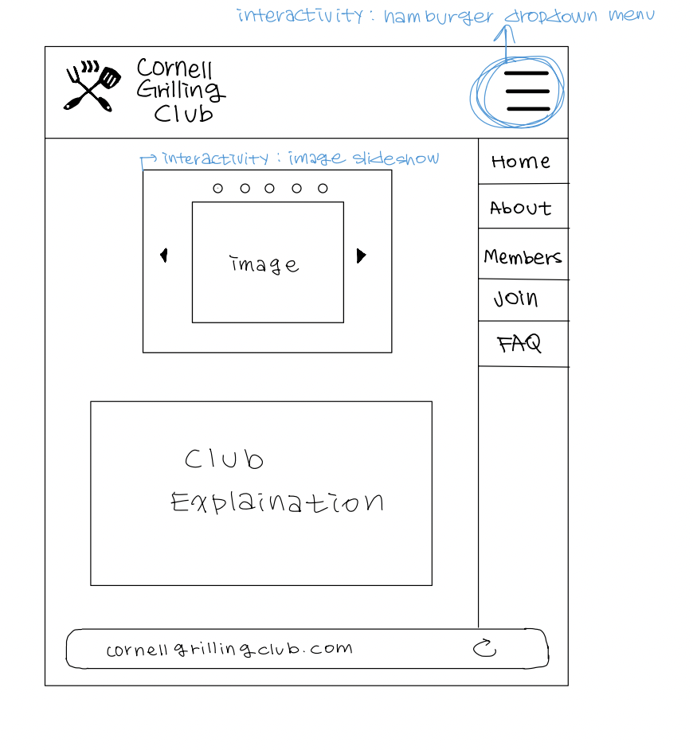
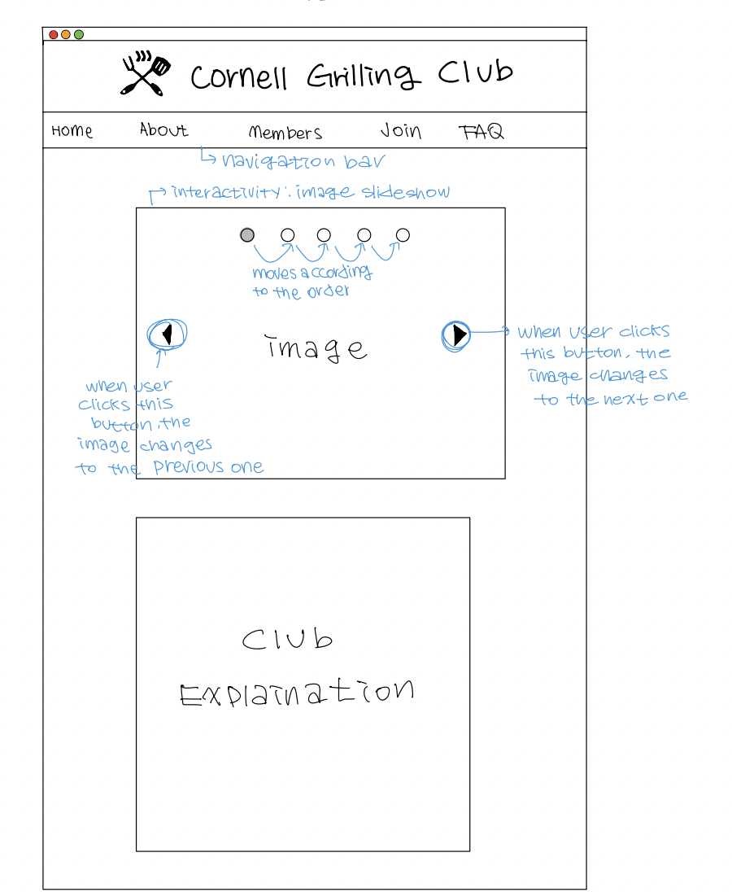

- The two images above are the sketches for the “About” page for mobile and desktop version. The wide version and narrow version both has the menu bar and image carousel which would be used as our interactivity elements. The wide version would have the navigation bar, and the narrow version would have the hamburger dropdown menu button that transforms the regular horizontal header navigation into a dropdown menu.

### Final Design (Milestone 2)
> Include the final sketches for each of your pages.
> **Include your final interactivity in your sketches.** Include annotations to explain what happens when the user takes an action with your interactivity.
> The sketches must include enough detail that another 1300 student could implement them.
> However, you don't need to provide layout/CSS annotations.
> Please, provide an explanation for each sketch.

**Narrow (Mobile) Design:**
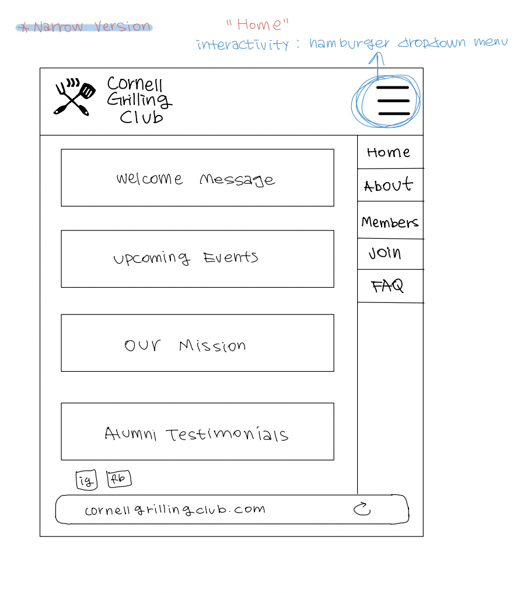
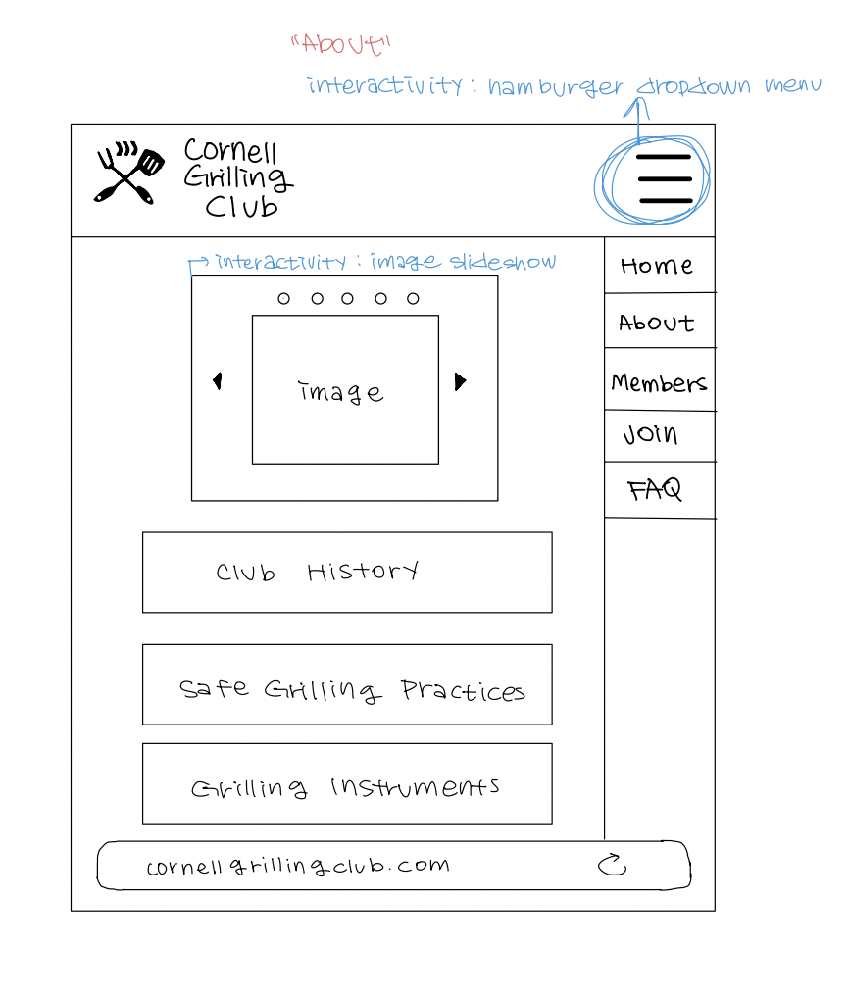
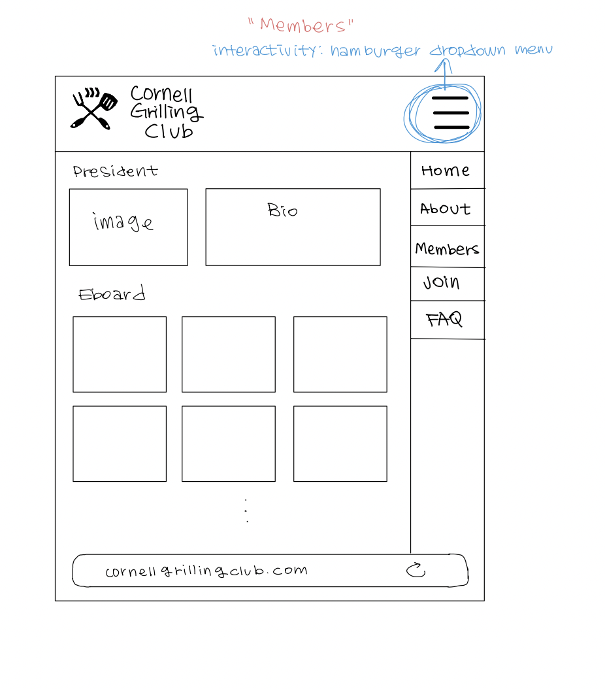
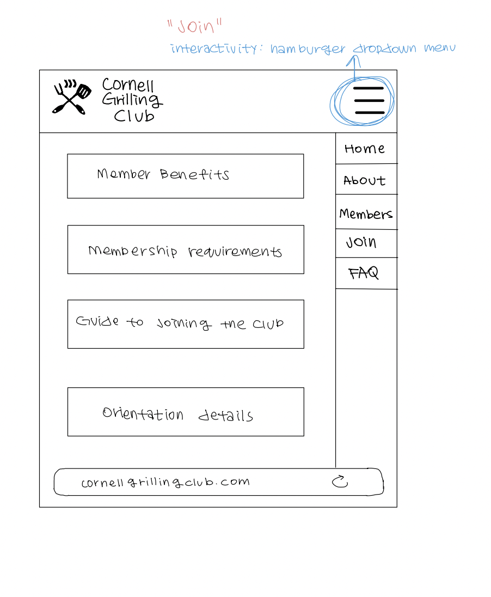
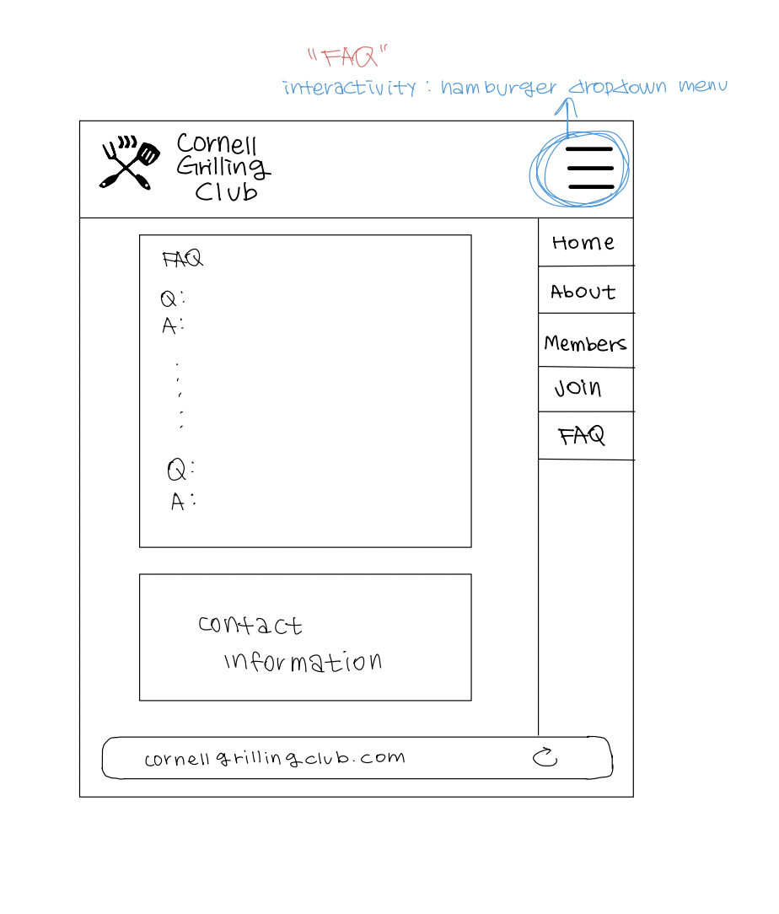

- The narrow (mobile) version design has the url tap on the buttom and has the hamburger dropdown menu that navigates to different pages. It also has the image carousel which provides multiple images with space efficiency. Annotations are included in the sketches.

**Wide (Wide) Design:**
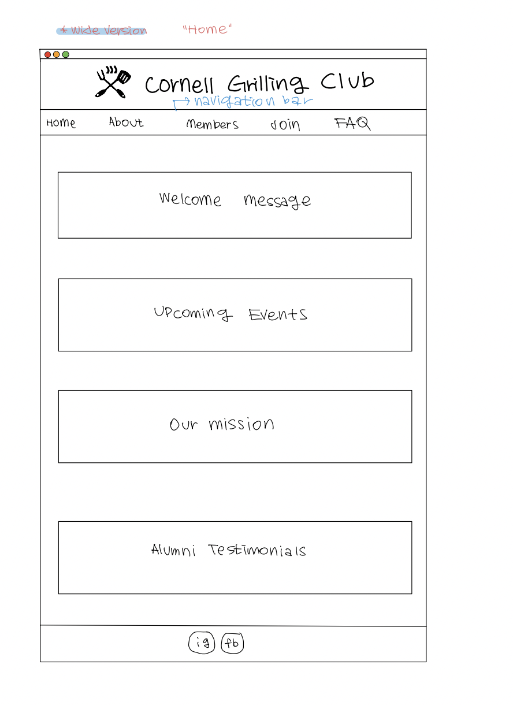
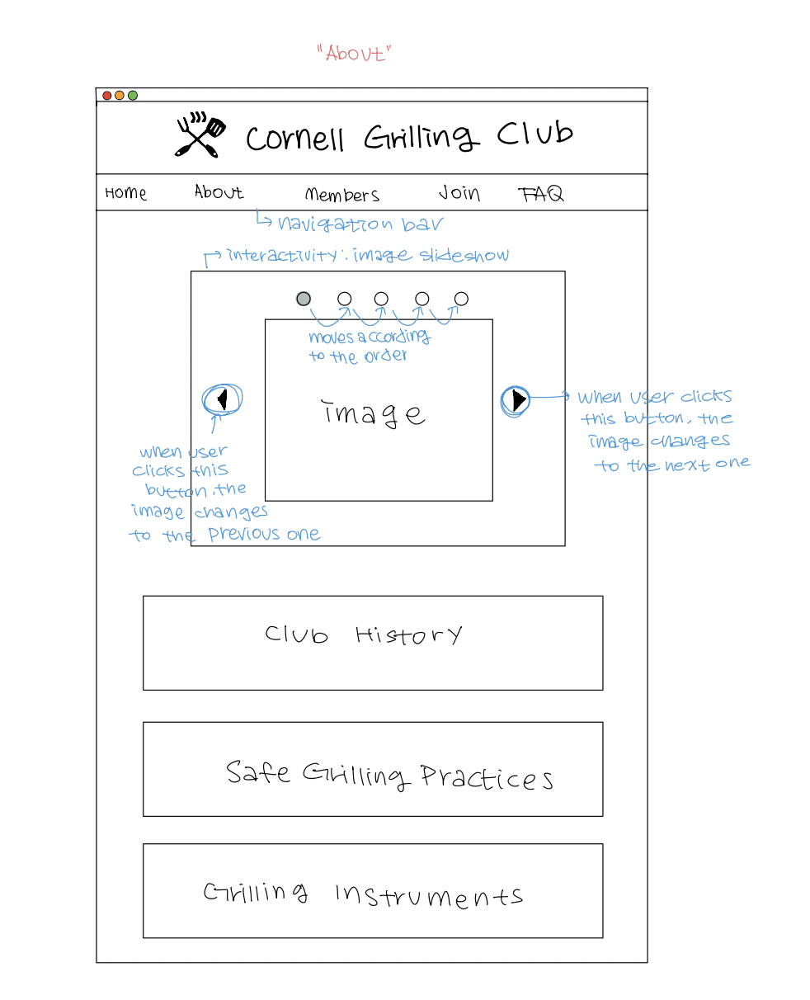
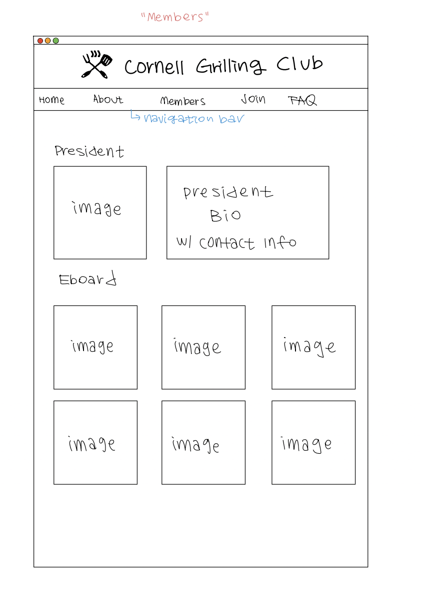
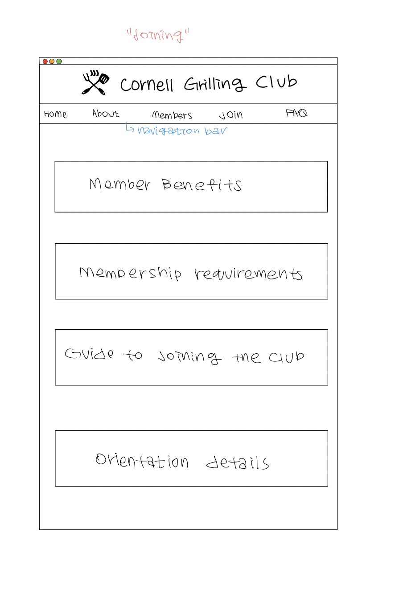
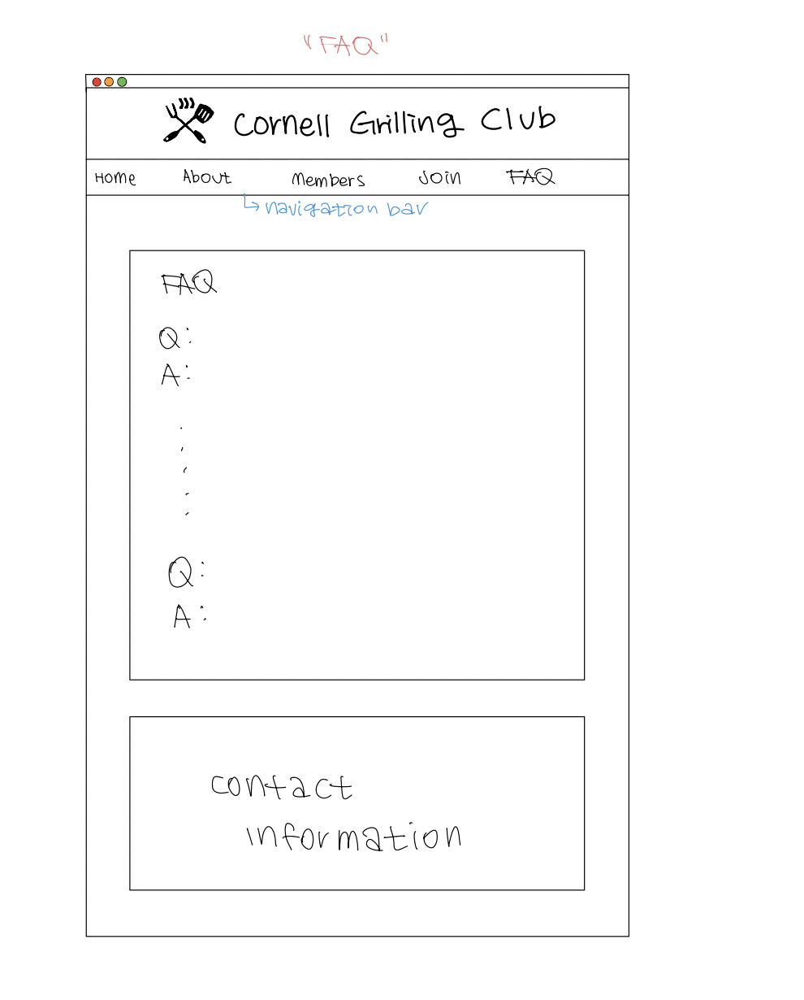

- The wide (desktop) version design has the tap navigation bar that navigates to different pages. It includes the image carousel as well and annotation.

### Design Rationale (Milestone 2)
> Explain why your design is appropriate for your audience.
> Specifically, why does your content organization, navigation, and site design/layout meet the goals of your users?
> How did you employ **design patterns** to improve the familiarity of the site for your audience?

The design is appropriate for the audience because it consists of showing all the necessary information desired by the audience in a simple manner where said audience can easily find that information. The content is organized into 3 main categories: what the club is about, who are its members, and how to join. Each of these categories has its own page on the website, and in terms of navigation, the addition of a hamburger menu makes it easy for both mobile and desktop users to navigate across pages. To improve familiarity of the site with the audience, we include the club name and logo at the top of the page right next to or above the navigation menu bar, as is consistent with most informative websites, especially the sample websites we used.

## Interactivity Rationale (Milestone 2)
> Describe the purpose of your proposed interactivity.
> Provide a brief rationale explaining how your proposed interactivity addresses the goals of your site's audience and enhances their user experience.

The purpose of the proposed photo carousel is to meet our goals of conveying what the club is about to the audience while enhancing user experience as they first visit the website. Being able to click through multiple photos showing the club’s operations will likely be the most informative way to convey information to the audience. Additionally, adding an interactive visual element will greatly enhance user experience, especially if it is put at the top of the home page, where users are most likely to interact with it.

## Interactivity Plan (Milestone 2)
> Now that you've designed your interactivity for your site, you need to plan how you will implement it.
> Describe how you will implement the interactivity. This should be a complete plan that another 1300 student could use to implement the interactivity.
> You should list the HTML elements, CSS classes, events, pseudocode, and the initial state.

Our plan is to use buttons, slides, and dots/circles for the photo carousel. We will need to implement javascript functions of nextSlide() and prevSlide() that wait for the user to click on the corresponding buttons or circles. In HTML, implementing the carousel, slide, button, and circle classes will look like this:

  

    
    
    
    
  

  

    
    
    
    
  

  
 #buttons
    <button class="prev-button" id="prev-button">&lt;</button>
    <button class="next-button" id="next-button">&gt;</button>
  

This ensures the buttons are on each side of the image being shown with the circles underneath. In CSS, we will use the corresponding .slides/.slide, .circle/.circles, #next-button, and #prev-button classes.

## Client Feedback & Minutes (Milestone 2)
> You should meet with your client again to obtain feedback on your design.
> Provide a summary of the client's feedback and your meeting's minutes.

Client likes the design. He likes the idea of a photo slideshow, and really likes the FAQ page and the team page. He would also like us to add the external links for campus groups and groupme.

30 minute conversation.

## User Testing (Final Submission)

**Conduct user testing with a minimum of 1 participant for every member of your team.**

### User Testing Tasks (Final Submission)
> Plan out your user testing tasks before doing your user testing.
> These must be actual user testing tasks.
> **Tasks are not questions!**

1. Please try to describe what the third image of the image carousel looks like!

2. Try to find the club president's name.

3. Try finding the link for GroupMe used for joining.

### Participant 1 (Final Submission)
> Using your notes from above, describe your user by answering the questions below.

1. Who is your user, e.g., where does the user come from, what is the user's job, characteristics, etc.?

    My user is an undergraduate junior student studying ORIE. She is potentially interested in joining new clubs for next semester.

2. Does the user belong to your audience of the site?

    > If “No”, what’s your strategy of associating the user test results to your audience’s needs and wants? How can your re-design choices based on the user tests make a better fit for the audience?

    Yes, she is interested in Grilling Club at Cornell.

### Participant 1 -- Testing Notes (Final Submission)
> When conducting user testing, you should take notes during the test.
Task 1 : Please try to describe what the third image of the image carousel looks like!
It looks like a group of friends enjoying the grilling activity. (She tried to click different navigation links on the top, and easily found the image carousel and it was working properly.)

Task 2 : Try to find the club president's name.
The club president's name is John Hanna. (Since the "Members" page from navigation bar seemed pretty obvious for president's info, she easily found the name of the president.)

Task 3 : Try finding the link for GroupMe used for joining.
I found it on the "Joining" page. (Because the page was clearly named based on its content which is joining information, she was able to find the GroupMe link for joining pretty easily.)

### Participant 2 (Final Submission)
> Using your notes from above, describe your user by answering the questions below.

1. Who is your user, e.g., where does the user come from, what is the user's job, characteristics, etc.?

    User is Kevi Elezi, a sophomore in the college of Arts and Sciences studying Economics. He is from New York City.

2. Does the user belong to your audience of the site?

    > If “No”, what’s your strategy of associating the user test results to your audience’s needs and wants? How can your re-design choices based on the user tests make a better fit for the audience?

    Yes.

### Participant 2 -- Testing Notes (Final Submission)
> When conducting user testing, you should take notes during the test.

Task 1 : Please try to describe what the third image of the image carousel looks like!
It's pretty simple to use the arrows to switch images. The image just looks like people grilling and having fun, which makes me more interested in grilling club if I see it is a fun thing to join.

Task 2 : Try to find the club president's name.
The president is John Hanna. I found him by clicking on the Members page, which was easy to find on the site's menu. I think it would be better to have a bigger bio section to make it more personal.

Task 3 : Try finding the link for GroupMe used for joining.
All the information needed to join is on the Joining page, which was easy to find because it was also on the site menu.

### Participant 3 -- Testing Notes (Final Submission)

Task 1 : Please try to describe what the third image of the image carousel looks like!
The user struggled at first to find the carrousel as they went around various pages before landing on the "About" page where they saw the arrows and clicked through. After clicking through it they went to the third page and described what was happening in the image with no trouble. It seemed like they knew how to navigate the arrows as they were able to go back and forth with the images after answer the question.

Task 2 : Try to find the club president's name.
"That's easy" they said, and they went over to the Member's page of the site and after a quick scan of the page they were able to say "John Hanna" is the president of the club."

Task 3 : Try finding the link for GroupMe used for joining.
After telling them this they did struggle a bit to find it. They first headed over to the FAQ's and scrolled through the page to try to find the link however they failed to do so. They then went over to the joining page and were able to find the link and pointed it out to me.

### Participant 3 (Final Submission)
> Using your notes from above, describe your user by answering the questions below.

1. Who is your user, e.g., where does the user come from, what is the user's job, characteristics, etc.?
User is currently an advising Dean at Cornell who is looking for ways to become more involved in the community.

2. Does the user belong to your audience of the site?
    > If “No”, what’s your strategy of associating the user test results to your audience’s needs and wants? How can your re-design choices based on the user tests make a better fit for the audience?

Yes they belong to the audience of this site because they are interested in grilling as a hobby but also because they are trying to meet others with similar interests.

### Participant 4 (Final Submission)
> Using your notes from above, describe your user by answering the questions below.

1. Who is your user, e.g., where does the user come from, what is the user's job, characteristics, etc.?
The user is Tahmidul Ambia, a sophomore majoring in computer science. He is from NYC and works as a cs instructor. He is a good-looking Asian man.

2. Does the user belong to your audience of the site?

   > If “No”, what’s your strategy of associating the user test results to your audience’s needs and wants? How can your re-design choices based on the user tests make a better fit for the audience?

   Yes, he is a Cornell undergrad open to joining clubs.

### Participant 4 -- Testing Notes (Final Submission)
> When conducting user testing, you should take notes during the test.

Task 1 : Please try to describe what the third image of the image carousel looks like!
It took him a second to find the carousel. It looks like people enjoying a grill day together. Would be helpful if there were captions.

Task 2 : Try to find the club president's name.
Went to members, and found president immediately. There is no way of contacting the president or any information about him at all.

Task 3 : Try finding the link for GroupMe used for joining.
Went to joining, and notes that the page is very empty. There is little to no description.

### Participant 5 -- Testing Notes (Final Submission)
Task 1 : Please try to describe what the third image of the image carousel looks like!
It took her 3 tries to find carousel. She didnt know what page it was on, after spending a 10 min looking she found it. User said the 3rd image is a pan of shrimp and veggies on a grill. Once she found the carousel it was easier for her to navigate through the pictures

Task 2 : Try to find the club president's name.
This was easy for her. Went straight to members page. Presidents Name is John Hanna

Task 3 : Try finding the link for GroupMe used for joining.
 This was also easy for her. She intially tried to scan the barcode right before she saw the "Join us on GroupMe" link on the Joining page

### Participant 5 (Final Submission)
> Using your notes from above, describe your user by answering the questions below.

1. Who is your user, e.g., where does the user come from, what is the user's job, characteristics, etc.?

    My user is an undergraduate junior student studying astrophysics. She is looking for clubs to join next semester

2. Does the user belong to your audience of the site?

    > If “No”, what’s your strategy of associating the user test results to your audience’s needs and wants? How can your re-design choices based on the user tests make a better fit for the audience?

    Yes, she is interested in Grilling Club at Cornell and wants to attend an event as a guest before the offical start of next semester

### Participant 6 (Final Submission)
> Using your notes from above, describe your user by answering the questions below.

1. Who is your user, e.g., where does the user come from, what is the user's job, characteristics, etc.?
The user is Omor Khan, a junior in Dyson. He is from New Jersey and is an ambassador for Bumble. He likes eating meat for fun.

2. Does the user belong to your audience of the site?

   > If “No”, what’s your strategy of associating the user test results to your audience’s needs and wants? How can your re-design choices based on the user tests make a better fit for the audience?

   Yes, he is a Cornell student looking to join a club.

### Participant 6 -- Testing Notes (Final Submission)
> When conducting user testing, you should take notes during the test.

Task 1 : Please try to describe what the third image of the image carousel looks like!
He looked through the index page for the carsaoul and then found it on the join page. He says it looks like "people eating together".

Task 2 : Try to find the club president's name.
Omor went to the members page and then quickly found the presdient, John Hanna at the top of the page.

Task 3 : Try finding the link for GroupMe used for joining.
He went to the join page and scrolled down to the QR code. underneath the qr code is the link to join.

## Website Revision Based on User Testing (Final Submission)
> What changes did you make to your design based on user testing?

One big issue was how sparse the website was. All the pages were named well, we were just missing content that users expected to find. For example, many users noted the lack of contact information for eboard members. In addition, users said that the joining page had insufficient content, with no description of what the groupme qr code is even for. In addition, we are going to try to make the carasoaul more usable. One of the users complained that the buttons were nowhere near the images and the buttons moved around so that's another change we want to make.

## Grading (Final Submission)

### Collaborators (Final Submission)
> List any persons you collaborated with on this project.

N/A

### Reference Resources (Final Submission)
> Please cite any external resources you referenced in the creation of your project.
> (i.e. W3Schools, StackOverflow, Mozilla, etc.)

N/A
